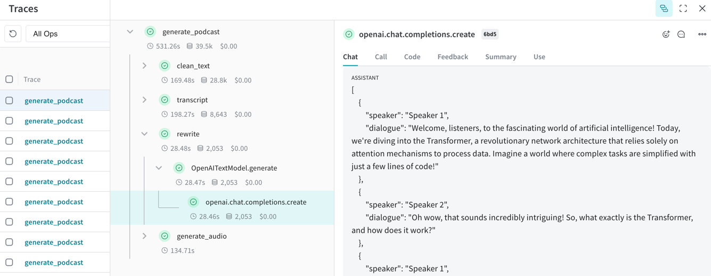

# NotebookLM OpenAI



## OpenAI

- Prepare environment variables, You can modify the model you want to use in the .env file.

```shell
cp .env.openai .env
```

- Install dependencies

```shell
poetry install
```

- Generate podcast
```shell
poetry run generate_podcast --input-file pdf/file/path
```


## Mlx

Set the local model you want to use, you can quickly start by using the `.env.mlx` file.

```shell
cp .env.mlx .env
```

install mlx_lm server and start it

```shell
pip install -U mlx_lm
mlx_lm.server
```

Generate podcast
```shell
poetry run generate_podcast --input-file pdf/file/path
```


